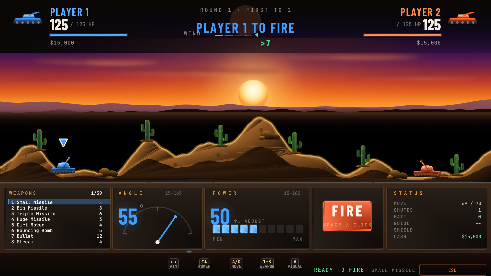
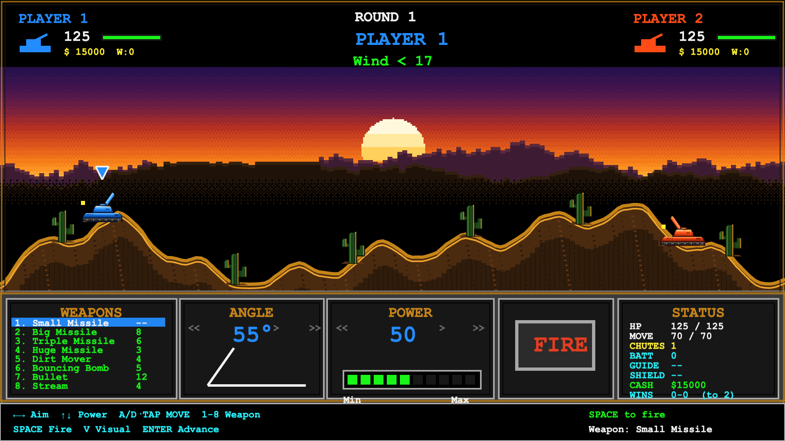
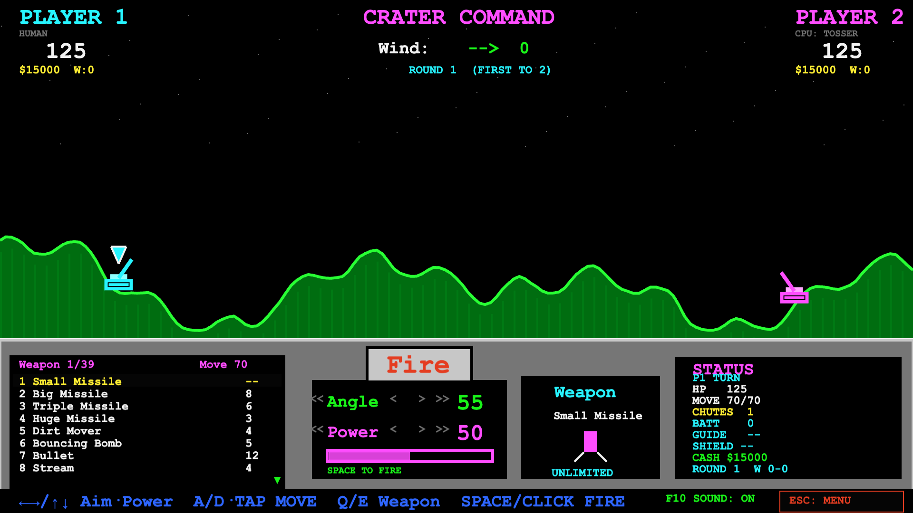
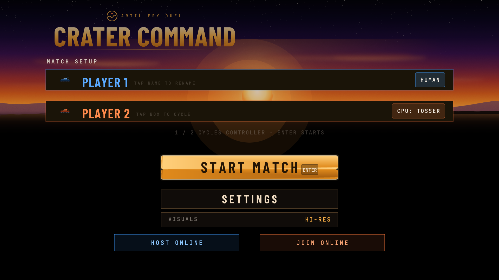

# Crater Command

**Play it now: https://vectorlane80.github.io/cratercommand/**

A browser artillery game in the spirit of **Scorched Earth** — destructible
terrain, a 39-weapon arsenal, shields and guidance systems, five CPU
personalities, a between-round economy with a drifting free market, and
peer-to-peer online play. Built with Vite + TypeScript + Phaser 3. No backend.

Three visual modes, switchable from the menu or with `V` in-match (your choice
persists across visits): **Classic** (neon vector), **Retro Pixel** (VGA sunset
sprite art), and **Hi-Res** (4× remastered sprites, sprite ballistics and blast
animations, gradient terrain, a glass-panel HUD with real typography, and a
logo wordmark).

Plus a fourth entry on the VISUALS cycle that is a whole different game:
**BANANAS** — a QBasic-era artillery homage. Apes on a procedurally
generated city skyline, one exploding banana that spins through the air,
one-hit kills, a smiling sun that gapes when a banana flies too close, and
no shop, no items, no walking. Entirely code-drawn in the EGA 16-color
palette; in a Bananas match `V` cycles the display instead — 16-COLOR →
AMBER → GREEN → WHITE, the last three strict two-tone phosphor-monitor
looks. Online, the host's mode decides the game for both players; the
display choice stays personal.

## Screenshots

**Hi-Res**



| Retro Pixel | Classic |
|---|---|
|  |  |



## Quick start

```bash
npm install
npm run dev
```

Open the printed Vite URL. `npm run build` produces a static bundle in `dist/`;
`npx vitest run` runs the test suite.

## The game

Two tanks — any mix of human and CPU — take turns lobbing shells across
procedurally generated, fully destructible terrain. Wind shifts every turn.
Last tank alive wins the round; first to the match's win target (best of
3/5/7) takes the match. Between rounds, everyone spends their earnings in
the shop.

### Arsenal — 39 weapons

- **Missiles:** Small (free/unlimited), Big, Triple, Huge, Missile, Baby Nuke, Nuke
- **Splitters:** MIRV, Death's Head, Leapfrog (sequential hops), Funky Bomb (chain bomblets)
- **Rollers:** Baby Roller / Roller / Heavy Roller — roll downhill until they find someone
- **Tunnelers:** Baby Digger / Digger / Heavy Digger (carve terrain), Baby Sandhog / Sandhog / Heavy Sandhog (bore until they hit a tank)
- **Riot:** Riot Charge, Riot Blast, Riot Bomb, Heavy Riot Bomb — dirt removal, no damage
- **Dirt:** Dirt Clod, Dirt Ball, Ton of Dirt, Liquid Dirt (flows and fills valleys), Earth Disrupter (settles terrain)
- **Fire & energy:** Napalm, Hot Napalm (flames flow downhill and pool), Plasma Blast, Laser (instant beam, costs batteries)
- **Utility:** Bullet, Stream, Bouncing Bomb, Tracer, Smoke Tracer, Dirt Mover

### Items — 15

Parachutes, Shield / Force Shield / Heavy Shield / Super Mag (armable, absorb
damage), Mag Deflector (pushes incoming shells away), Auto Defense (auto-arms
your best shield each round), Batteries (heal + power the laser), Fuel Tanks
(extra movement), Contact Triggers (shells detonate on first touch), and five
guidance systems: Heat, Ballistic, Horizontal, Vertical, Lazy Boy.

### Match options

- **Walls:** none / concrete / padded / rubber / spring / wraparound / random / erratic
- **Physics:** gravity (5 steps), air viscosity (4 steps), tanks-fall on/off — persisted in localStorage
- **Match length:** best of 3 / 5 / 7

### CPU personalities

Moron, Shooter, Tosser, Spoiler, and Cyborg — each with its own targeting
strategy (from random lobs to physics-correct solutions with tactical target
selection) and its own shopping priorities between rounds.

### Economy

Cash from damage dealt ($30/HP), round wins ($5,000), and survival ($1,500).
5% interest on savings between rounds. Prices drift on a persistent free
market — buy in bulk and the price climbs; ignore an item and it slides back.
Random sales each round.

### Online play

Peer-to-peer 2-player via PeerJS (public signaling only — no game server).
One player hosts and shares a 4-character code; the host runs the authoritative
simulation and streams snapshots, the joiner sends inputs. Wall mode and
physics settings carry over from the host's menu selections.

## Controls

| Key | Action |
|---|---|
| ←/→, ↑/↓ | Aim / power |
| A / D | Move tank (uses move budget + fuel) |
| Q / E | Cycle weapon; 1–0 direct-select |
| Space / click FIRE | Fire |
| B | Use battery (heal) |
| X | Arm a shield |
| C | Cycle guidance system |
| V | Cycle visual mode in Scorched matches (classic / retro pixel / hi-res); cycle the display in Bananas matches (16-color / amber / green / white) |
| F10 | Sound on/off |
| ESC | Forfeit / menu |

Menu: G / A / F cycle gravity, air viscosity, tanks-fall; W walls; B match
length. Tap a player's name to rename them (in-page editor, no browser
pop-up). Full mouse/touch parity throughout.

## Architecture (short version)

`BootScene → MenuScene → LobbyScene (online) → GameScene`. GameScene owns all
mutable state and orchestrates stateless-ish systems: Terrain, Projectile,
Tank, Turn, Hud, AI, Economy, Sound, Network, Visual. All tunables — every
weapon, item, price, and physics constant — live in `GAME_CONFIG`
(`src/game/types/GameTypes.ts`); most features are data-driven from those
tables.

## Tests

200+ unit tests (vitest) cover terrain math, projectile behaviors, the
economy, AI solvers, turn logic, and online snapshot round-trips. Phaser is
stubbed for tests; a stub-fidelity suite pins the stub against the real
package's math.
